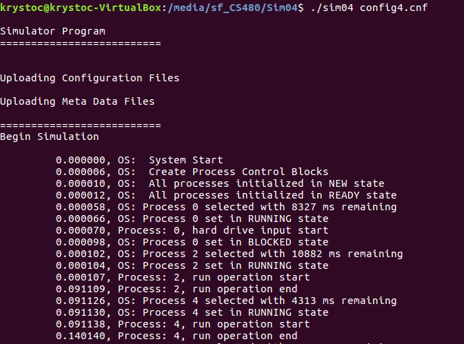
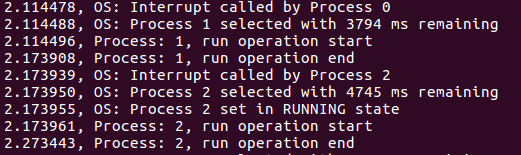
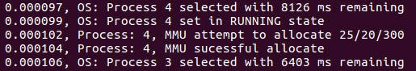
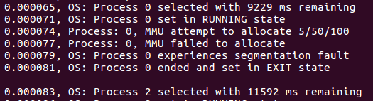
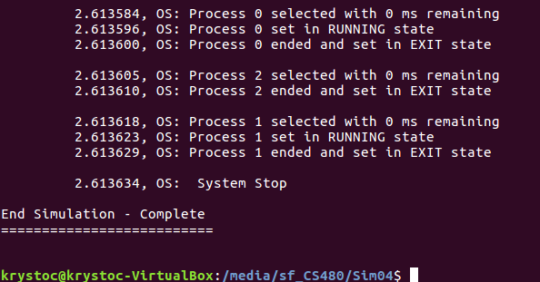
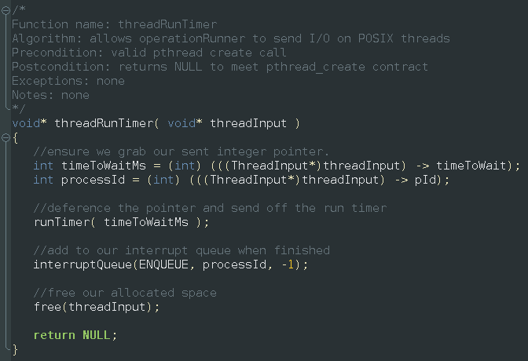
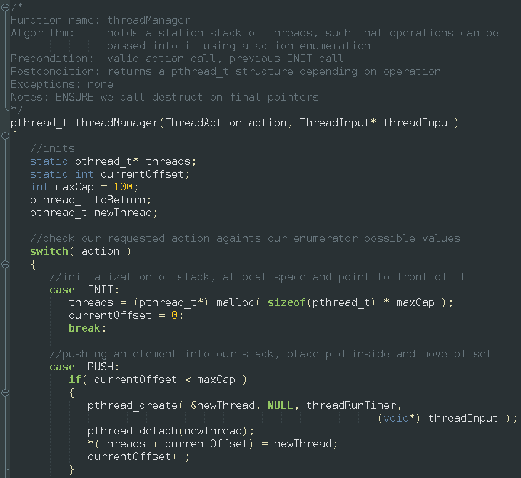
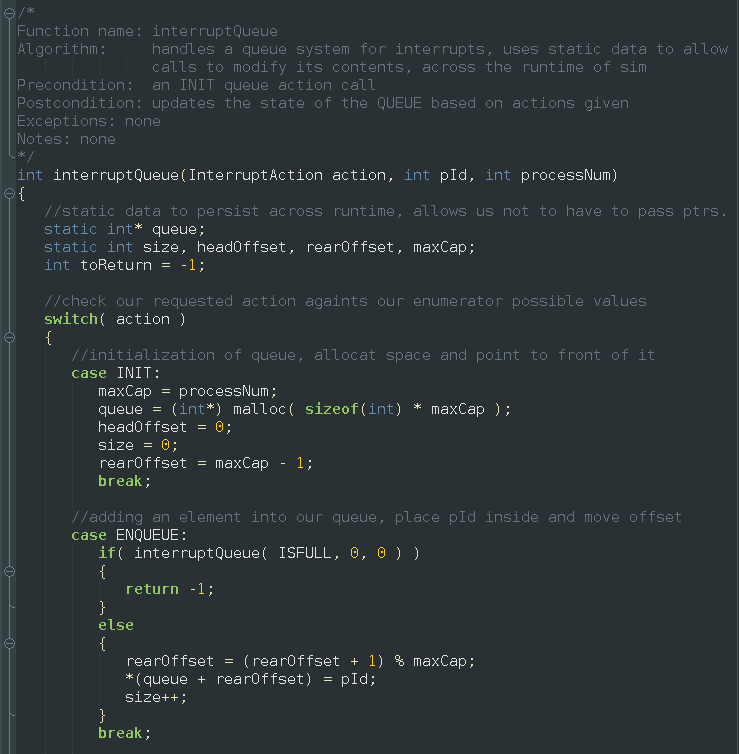
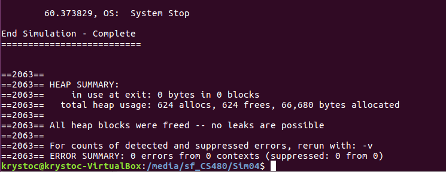

# Operating System Simulator

This simulator tool was built to emulate the actions of a real-world operating system at the base level. Given a configuration file and a meta-data file, the simulator will dynamically run a set of operations based on the processes in the file. Dependent on configuration set-up the simulator will either write these actions as they are executed, write them to a LogFile after simulator has completed its operation, or both of these actions.

## Installation

* Clone or otherwise download simulator (and config/meta-data files) you wish to run, most current build with features is **Sim04**
* Compile onto your machine using: "**make -f sim04_mf**"
* Execute using command such as **./sim04** with an append of the config file to be run **./sim04 config5.cnf**

+ The simulator is built to handle 5 different job scheduling codes, modified in config.cnf's: 
    
    + FCFS-N  (First Come First Serve - Non-Preemptive)
    + FCFS-P  (First Come First Serve - Preemptive)
    + SJF-N   (Shortest Job First - Non-Preemptive)
    + SRTF-P  (Shortest Run Time First - Preemptive)
    + RR-P    (Round-Robin - Preemptive)

## Usage

+ Upon running the simulator, it will begin by parsing the given Configuration / Meta-data Files, if there is problems with this step, the simulator will report them and exit safely

+ Operations within the meta-data file have three operation types:
  + P:    Process operations will utilize the timer.c methods to simulate "running" of desired processing, and will continue until the operation time has been completed.
  + I/O:  I/O operations (Keyboard, monitor, etc) will emulate real world operations by being sent on POSIX threads to wait for their completion times. Allowing the OS to continue working on processes until the I/O operation returns with an **INTERRUPT**
  + M:    Memory actions will attempt an allocation of memory on the system, if successful operation of that process continues normally. On failure the process will experience a **Segmentation Fault** and immediately stop processing and placed in an **EXIT** state 
  
  **INTERRUPT EXAMPLE:**
  
  
  
  **ALLOCATION SUCCESS:**
  
  
  
  **ALLOCATION FAILURE / SEG FAULT:**
  
  

+ After all processes have been completed and set in **EXIT** state the Operating System will clean up allocated memory and end the Simulation.

  

## Code Highlights

+ POSIX Thread operations: Utilization of the POSIX library to send off threads for I/O operations. These allow the UNIX machine to process the running times of the I/O ops seperately. Upon completion it places the 

+ Thread Stack: Thread manager stack to manage our POSIX threads in operation. Utilizes **STATIC DATA** methodology to allow consistent access across simulator, utilizing **JOB-CODES** sent into the threadManager.

+ Interrupt Queue: Utilizes to maintain an interrupt queue of process id's calling their interrupt status. To be used by the Main OS simulator to decide the next appropriate action.

## Valgrind

Memory Management operations verified utilizing the **Valgrind** Dynamic Analysis Tool available at: http://www.valgrind.org/

## License
MIT License

Copyright (c) [2019] [Kristopher Moore]

Permission is hereby granted, free of charge, to any person obtaining a copy
of this software and associated documentation files (the "Software"), to deal
in the Software without restriction, including without limitation the rights
to use, copy, modify, merge, publish, distribute, sublicense, and/or sell
copies of the Software, and to permit persons to whom the Software is
furnished to do so, subject to the following conditions:

The above copyright notice and this permission notice shall be included in all
copies or substantial portions of the Software.

THE SOFTWARE IS PROVIDED "AS IS", WITHOUT WARRANTY OF ANY KIND, EXPRESS OR
IMPLIED, INCLUDING BUT NOT LIMITED TO THE WARRANTIES OF MERCHANTABILITY,
FITNESS FOR A PARTICULAR PURPOSE AND NONINFRINGEMENT. IN NO EVENT SHALL THE
AUTHORS OR COPYRIGHT HOLDERS BE LIABLE FOR ANY CLAIM, DAMAGES OR OTHER
LIABILITY, WHETHER IN AN ACTION OF CONTRACT, TORT OR OTHERWISE, ARISING FROM,
OUT OF OR IN CONNECTION WITH THE SOFTWARE OR THE USE OR OTHER DEALINGS IN THE
SOFTWARE.
